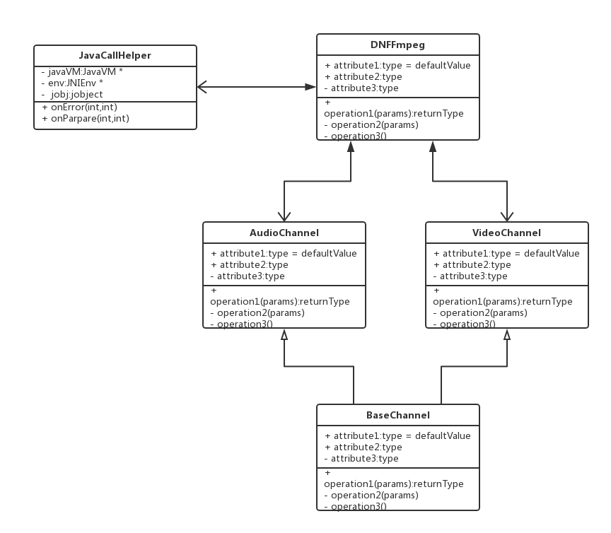

# TVPlayer

基于FFmpeg的Android移动端音视频播放器，用于学习FFmpeg解码流程以及NDK相关的技术。

## 程序结构



## 功能
视频源m3u8，可能失效，如果失效可到[iptv](https://github.com/iptv-org/iptv)获取最新的源。


## [C/C++基础知识](notes/CAndCPlusPlus.md)


## [JNI](notes/JNI.md)


## [音视频基础知识](notes/音视频基础知识.md )


## FFmpeg

### 下载编译FFmpeg

```sh
wget https://ffmpeg.org/releases/ffmpeg-4.0.2.tar.bz2
tar xvf ffmpeg-4.0.2.tar.bz2
# 编译，将notes/build.sh拷贝到ffmpeg-4.0.2，然后进入ffmpeg-4.0.2目录
./build.sh
cd ~/ffmpeg/ffmpeg-4.0.2/android/armeabi-v7a_lsn11
tar cvf ffmpeg.tar *

# 把多个静态库打包成动态库
/root/android-ndk-r17c/toolchains/arm-linux-androideabi-4.9/prebuilt/linux-x86_64/bin/arm-linux-androideabi-gcc --sysroot=/root/android-ndk-r17c/platforms/android-21/arch-arm -shared -o libffmpeg.so -Wl,--whole-archive libavcodec.a libavformat.a libavutil.a libswresample.a libswscale.a libavfilter.a -Wl,--no-whole-archive
```

### [FFmpeg常用结构体](notes/常用结构体.xmind )

### [FFmpeg解码的数据结构](notes/FFmpeg解码的数据结构.xmind)

### [解码流程](notes/解码流程.xmind)

### [视频原生绘制](notes/视频原生绘制.md)

### 音频解码与OpenSL ES播放

> 相关资料：[Android ndk-samples有关使用OpenSLES播放音频的示例](https://github.com/android/ndk-samples/blob/main/native-audio/app/src/main/cpp/native-audio-jni.c)
>
> RGB、YUV：图像原始格式
> PCM：声音原始格式
>
> Android 播放PCM 有以下几种格式：
> 1、java SDK：AudioTrack（AudioRecorder录音）
> 2、NDK：OpenSL ES


### 音视频同步

> 音视频同步方式：
>    1、将视频根据音频同步（以音频为主）
>    2、以视频为主
>    3、以一个外部时间进度为主
>
> I/P/B与pts、bts说明


### 停止与释放

> 暂停：
>    java调用一个pause方法，native层 在读取媒体包的时候停止
>    我们的tvplayer可以不用在读取的时候管，因为有:
>     if (audioChannel && audioChannel->pkt_queue.size() > 100) {
>                    av_usleep(1000 * 10);
>                    continue;
>             }
>            if (videoChannel && videoChannel->pkt_queue.size() > 100) {
>                av_usleep(1000 * 10);
>                   continue;
>             }
>
>    在播放的线程中，用条件变量 wait ：pthread_cond_wait(&cond, &mutex);
>    resume 就通知  pthread_cond_signal(&cond);