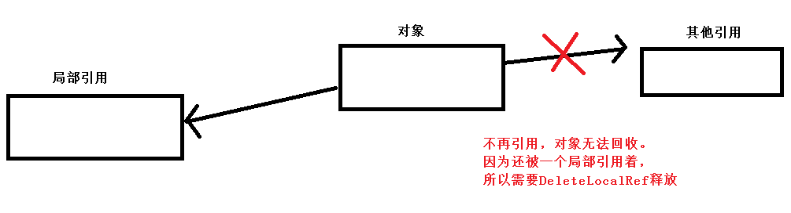

## JNI编程

[TOC]

> JNI是一种本地编程接口。它允许运行在JAVA虚拟机中的JAVA代码和用其他编程语言，诸如C语言、C++、汇编，写的应用和库之间的交互操作。 

### 第一个JNI程序

```cmake
# 引入jni头文件支持
include_directories("C:/Program Files/Java/jdk1.8.0_171/include")
# windows:win32  Mac:darwin
include_directories("C:/Program Files/Java/jdk1.8.0_171/include/win32")
# lsn7jni: 生成库的名字；
# SHARED：需要给java加载，不能生成静态库，要生成动态库；
# lsn7_jni.cpp：源文件
add_library(lsn7jni SHARED lsn7_jni.cpp)
```

> 最终你的动态库会生成在下面位置( 可以修改)


> 然后打开一个Java IDE （AS/ECLIPSE/文本文档 都行）
>
> 例子：在AS的java单元测试下进行编写（此时使用的是电脑的java环境）

```java
 @Test
public void addition_isCorrect() {
        assertEquals(4, 2 + 2);
        //加载指定动态库 注意：当前我的电脑系统是64位
        System.load("xxxx/lsn7jni.dll");
  			//会到环境变量PATH中去查找
  			//System.loadLibrary("lsn7jni.dll");
    		//调用jni方法
        System.out.println(test(1,"22",3.1f));
}
native String test(int i,String j,float k);
```


> 然后在VS中编写

```c++
// lsn6_jni.cpp: 定义应用程序的入口点。
//
#include "jni.h"
//编写jni的时候，c++中需要以c的方式编译，如果是c则不需要加入以下语句
extern "C"
//JNIEnv: 由Jvm传入与线程相关的变量。定义了JNI系统操作、java交互等方法。
//jobject: 表示当前调用对象，即 this , 如果是静态的native方法，则获得jclass
JNIEXPORT jstring JNICALL Java_com_dongnao_jniTest_ExampleUnitTest_test
(JNIEnv *env, jobject, jint i, jstring j, jfloat k) {
	// 获得c字符串  
	// 开闭内存x，拷贝java字符串到x中 返回指向x的指针
	// 参数2 isCopy：true：是拷贝的一个新数据（新申请的一个内存空间）；false：就是使用的java的数组（地址）
	//提供一个boolean（int）指针，用于接收jvm传给我们的字符串是否是拷贝的。
	//通常，我们不关心这个,一般传个NULL就可以
	const char* str = env->GetStringUTFChars(j, JNI_FALSE);
	char returnStr[100];
	//格式化字符串
	sprintf(returnStr,"C++ string:%d,%s,%f",i,str,k);
	//释放掉内存 x
	env->ReleaseStringUTFChars(j,str);
	// 返回java字符串
	return  env->NewStringUTF(returnStr);
}
```

> 现在第一个jni程序就已经能够运行了，在AS中运行单元测试进行jni方法的测试

> 对于不熟悉的同学可以,使用javah获得方法该如何声明。javah是JDK中提供的工具(Java环境变量不用说了吧？)
>
> javah -o [输出文件名]   \[全限定名\]
>
> D:\Lance\ndk\lsn7_jni\JniTest\app\src\test\java> javah -o ExampleUnitTest.h com.dongnao.jniTest.ExampleUnitTest


### JNI数据类型

> JNIEXPORT 和 JNICALL，定义在`jni_md.h`头文件中。
>
> JNIEXPORT：
>
> ​	在 Windows 中,定义为`__declspec(dllexport)`。因为Windows编译 dll 动态库规定，如果动态库中的函数要被外部调用，需要在函数声明中添加此标识，表示将该函数导出在外部可以调用。
>
> ​	在 Linux/Unix/Mac os/Android 这种 Like Unix系统中，定义为`__attribute__ ((visibility ("default")))`
>
> ​	GCC 有个visibility属性, 该属性是说, 启用这个属性:
>
> 1. 当-fvisibility=hidden时
>
>    动态库中的函数默认是被隐藏的即 hidden. 除非显示声明为`__attribute__((visibility("default")))`.
>
> 2. 当-fvisibility=default时
>
>     动态库中的函数默认是可见的.除非显示声明为`__attribute__((visibility("hidden")))`.
>
> JNICALL:
>
> ​	在类Unix中无定义，在Windows中定义为：`_stdcall  ` ，一种函数调用约定
>
> 类Unix系统中这两个宏可以省略不加。	

| Java类型  | 本地类型      | 描述                                                         |
| --------- | ------------- | ------------------------------------------------------------ |
| boolean   | jboolean      | C/C++8位整型                                                 |
| byte      | jbyte         | C/C++带符号的8位整型                                         |
| char      | jchar         | C/C++无符号的16位整型                                        |
| short     | jshort        | C/C++带符号的16位整型                                        |
| int       | jint          | C/C++带符号的32位整型                                        |
| long      | jlong         | C/C++带符号的64位整型                                        |
| float     | jfloat        | C/C++32位浮点型                                              |
| double    | jdouble       | C/C++64位浮点型                                              |
| Object    | jobject       | 任何Java对象，或者没有对应java类型的对象；在jni中，所有引用类型的基类是jobject |
| Class     | jclass        | Class对象                                                    |
| String    | jstring       | 字符串对象                                                   |
| Object[]  | jobjectArray  | 任何对象的数组                                               |
| boolean[] | jbooleanArray | 布尔型数组                                                   |
| byte[]    | jbyteArray    | 比特型数组                                                   |
| char[]    | jcharArray    | 字符型数组                                                   |
| short[]   | jshortArray   | 短整型数组                                                   |
| int[]     | jintArray     | 整型数组                                                     |
| long[]    | jlongArray    | 长整型数组                                                   |
| float[]   | jfloatArray   | 浮点型数组                                                   |
| double[]  | jdoubleArray  | 双浮点型数组                                                 |

```C++
C/C++中获取java的数组时：

extern "C"
JNIEXPORT jstring JNICALL
Java_com_dongnao_jnitest_MainActivity_test(JNIEnv *env, jobject instance, jobjectArray a_,jintArray b_) {
	//1、 获得字符串数组
    //获得数组长度
    int32_t str_length = env->GetArrayLength(a_);
    LOGE("字符串 数组长度:%d",str_length);
    //获得字符串数组的数据
    for (int i = 0; i < str_length; ++i) {
        jstring str = static_cast<jstring>(env->GetObjectArrayElement(a_, i));
        const char* c_str =  env->GetStringUTFChars(str, 0);
        LOGE("字符串有:%s",c_str);
        //使用完释放
        env->ReleaseStringUTFChars(str,c_str);
    }
	//2、获得基本数据类型数组
    int32_t int_length = env->GetArrayLength(b_);
    LOGE("int 数组长度:%d",int_length);
    //b：指向数组首元素地址；对应的有 GetBoolean 、GetFloat等
    jint *b = env->GetIntArrayElements(b_, 0);
  //c调用：(*env)->GetIntArrayElements(env, b_, 0);
    for (int i = 0; i < int_length; i++) {
        LOGE("int 数据有:%d",b[i]);
    }
  	//参数3：mode
  	//0：刷新java数组，并释放C/C++数组
  //1: JNI_COMMIT 只刷新java数组
  //2: JNI_ABORT 只释放
    env->ReleaseIntArrayElements(b_, b, 0);
    return env->NewStringUTF("222");
}
```


### C/C++反射Java

#### 反射方法

> 在C/C++中反射创建Java的对象，调用Java的方法

```java
package com.dongnao.jnitest;
import android.util.Log;

public class Helper {
    private static final String TAG = "Helper";
	//private和public 对jni开发来说没任何区别 都能反射调用
    public void instanceMethod(String a,int b,boolean c){
        Log.e(TAG,"instanceMethod a=" +a +" b="+b+" c="+c );
    }

    public static void staticMethod(String a,int b,boolean c){
        Log.e(TAG,"staticMethod a=" +a +" b="+b+" c="+c);
    }
}

extern "C"
JNIEXPORT void JNICALL
Java_com_dongnao_jnitest_MainActivity_invokeHelper(JNIEnv *env, jobject instance) {
    jclass clazz = env->FindClass("com/dongnao/jnitest/Helper");
    //获得具体的静态方法 参数3：签名（下方说明）
    //如果不会填 可以使用javap
    jmethodID staticMethod = env->GetStaticMethodID(clazz,"staticMethod","(Ljava/lang/String;IZ)V");
    //调用静态方法
    jstring staticStr= env->NewStringUTF("C++调用静态方法");
    env->CallStaticVoidMethod(clazz,staticMethod,staticStr,1,1);

    //获得构造方法 <init>：构造方法写法
    jmethodID constructMethod = env->GetMethodID(clazz,"<init>","()V");
    //创建对象
    jobject  helper = env->NewObject(clazz,constructMethod);
    jmethodID instanceMethod = env->GetMethodID(clazz,"instanceMethod","(Ljava/lang/String;IZ)V");
    jstring instanceStr= env->NewStringUTF("C++调用实例方法");
    env->CallVoidMethod(helper,instanceMethod,instanceStr,2,0);

    //释放
    env->DeleteLocalRef(clazz);
    env->DeleteLocalRef(staticStr);
    env->DeleteLocalRef(instanceStr);
    env->DeleteLocalRef(helper);
}
```


> 基本数据类型的签名采用一系列大写字母来表示, 如下表所示:

| Java类型 | 签名             |
| -------- | ---------------- |
| boolean  | Z                |
| short    | S                |
| float    | F                |
| byte     | B                |
| int      | I                |
| double   | D                |
| char     | C                |
| long     | J                |
| void     | V                |
| 引用类型 | L + 全限定名 + ; |
| 数组     | [+类型签名       |

> 可以使用javap来获取反射方法时的签名

```shell
#cd 进入 class所在的目录 执行： javap -s 全限定名,查看输出的 descriptor
D:\Lance\ndk\lsn7_jni\JniTest\app\build\intermediates\classes\debug>javap -s com.dongnao.jnitest.Helper
Compiled from "Helper.java"
public class com.dongnao.jnitest.Helper {
  public com.dongnao.jnitest.Helper();
    descriptor: ()V

  public void instanceMethod(java.lang.String, int, boolean);
    descriptor: (Ljava/lang/String;IZ)V

  public static void staticMethod(java.lang.String, int, boolean);
    descriptor: (Ljava/lang/String;IZ)V
}
```


#### 反射属性

```java
int a = 10;
static String b = "java字符串";
private static final String TAG = "Helper";

public void testReflect() {
        Log.e(TAG,"修改前 ： a = " +a +" b="+b);
        reflectHelper();
        Log.e(TAG,"修改后 ： a = " +a +" b="+b);
}
public  native void  reflectHelper();


extern "C"
JNIEXPORT void JNICALL
Java_com_dongnao_jnitest_Helper_reflectHelper(JNIEnv *env, jobject instance) {

    //instance 就是 helper
    jclass clazz = env->GetObjectClass(instance);
    //获得int a的标示
    jfieldID a = env->GetFieldID(clazz,"a","I");
    int avalue = env->GetIntField(instance,a);
    LOGE("获得java属性a:%d",avalue);
    //修改属性值
    env->SetIntField(instance,a,100);

    jfieldID b = env->GetStaticFieldID(clazz,"b","Ljava.lang.String;");
    //获取值
    jstring bstr = static_cast<jstring>(env->GetStaticObjectField(clazz, b));
    const char* bc_str = env->GetStringUTFChars(bstr,0);
    LOGE("获得java属性b:%s",bc_str);

    //修改
    jstring new_str = env->NewStringUTF("C++字符串");
    env->SetStaticObjectField(clazz,b,new_str);

    env->ReleaseStringUTFChars(bstr,bc_str);
    env->DeleteLocalRef(new_str);
    env->DeleteLocalRef(clazz);
}
```


### JNI引用

> 在 JNI 规范中定义了三种引用：局部引用（Local Reference）、全局引用（Global Reference）、弱全局引用（Weak Global Reference）。

#### 局部引用

> 大多数JNI函数会创建局部引用。NewObject/FindClass/NewStringUTF 等等都是局部引用。
>
> 局部引用只有在创建它的本地方法返回前有效,本地方法返回后，局部引用会被自动释放。
>
> 因此无法跨线程、跨方法使用。

```c++
extern "C"
JNIEXPORT jstring JNICALL
xxx(JNIEnv *env, jobject instance) {
	//错误
	//不能在本地方法中把局部引用存储在静态变量中缓存起来供下一次调用时使用。
	// 第二次执行 str依然有值，但是其引用的 “C++字符串” 已经被释放
    static jstring str;
    if(str == NULL){
    	 str = env->NewStringUTF("C++字符串");
    }
    return str;
}
```

> **释放一个局部引用有两种方式:**
>
> **1、本地方法执行完毕后VM自动释放；**
>
> **2、通过DeleteLocalRef手动释放；**
>
> VM会自动释放局部引用，为什么还需要手动释放呢？
>
> 因为局部引用会阻止它所引用的对象被GC回收。 



#### 全局引用

> 全局引用可以跨方法、跨线程使用，直到它被手动释放才会失效 。
>
> 由 NewGlobalRef  函数创建

```c++
extern "C"
JNIEXPORT jstring JNICALL
Java_com_dongnao_jnitest_MainActivity_test1(JNIEnv *env, jobject instance) {
	//正确
    static jstring globalStr;
    if(globalStr == NULL){
        jstring str = env->NewStringUTF("C++字符串");
        //删除全局引用调用  DeleteGlobalRef
        globalStr = static_cast<jstring>(env->NewGlobalRef(str));
        //可以释放，因为有了一个全局引用使用str，局部str也不会使用了
        env->DeleteLocalRef(str);
    }
    return globalStr;
}
```


#### 弱全局引用

> 与全局引用类似，弱引用可以跨方法、线程使用。与全局引用不同的是，弱引用不会阻止GC回收它所指向的VM内部的对象 。
>
> 在对Class进行弱引用是非常合适的（FindClass），因为Class一般直到程序进程结束才会卸载。
>
> 在使用弱引用时，必须先检查缓存过的弱引用是指向活动的对象，还是指向一个已经被GC的对象

```c++
extern "C"
JNIEXPORT jclass JNICALL
Java_com_dongnao_jnitest_MainActivity_test1(JNIEnv *env, jobject instance) {
    static jclass globalClazz = NULL;
    //对于弱引用 如果引用的对象被回收返回 true，否则为false
    //对于局部和全局引用则判断是否引用java的null对象
    jboolean isEqual = env->IsSameObject(globalClazz, NULL);
    if (globalClazz == NULL || isEqual) {
        jclass clazz = env->GetObjectClass(instance);
        //删除使用 DeleteWeakGlobalRef
        globalClazz = static_cast<jclass>(env->NewWeakGlobalRef(clazz));
        env->DeleteLocalRef(clazz);
    }
    return globalClazz;
}
```


### JNI_OnLoad

> 调用System.loadLibrary()函数时， 内部就会去查找so中的 JNI_OnLoad 函数，如果存在此函数则调用。
>
> JNI_OnLoad会：
>
> 告诉 VM 此 native 组件使用的 JNI 版本。
>
> ​	对应了Java版本，android中只支持JNI_VERSION_1_2 、JNI_VERSION_1_4、JNI_VERSION_1_6 
>
> ​	在JDK1.8有 JNI_VERSION_1_8。

```c++
jint JNI_OnLoad(JavaVM* vm, void* reserved){
    // 2、4、6都可以
    return JNI_VERSION_1_4;
}
```


#### 动态注册

> 在此之前我们一直在jni中使用的 Java_PACKAGENAME_CLASSNAME_METHODNAME 来进行与java方法的匹配，这种方式我们称之为静态注册。
>
> 而动态注册则意味着方法名可以不用这么长了，在android aosp源码中就大量的使用了动态注册的形式

```c++
//Java：
native void dynamicNative();
native String dynamicNative(int i);

//C++：
void  dynamicNative1(JNIEnv *env, jobject jobj){
    LOGE("dynamicNative1 动态注册");
}
jstring  dynamicNative2(JNIEnv *env, jobject jobj,jint i){
    return env->NewStringUTF("我是动态注册的dynamicNative2方法");
}

//需要动态注册的方法数组
static const JNINativeMethod mMethods[] = {
        {"dynamicNative","()V", (void *)dynamicNative1},
        {"dynamicNative", "(I)Ljava/lang/String;", (jstring *)dynamicNative2}

};
//需要动态注册native方法的类名
static const char* mClassName = "com/dongnao/jnitest/MainActivity";
jint JNI_OnLoad(JavaVM* vm, void* reserved){
    JNIEnv* env = NULL;
    //获得 JniEnv
    int r = vm->GetEnv((void**) &env, JNI_VERSION_1_4);
    if( r != JNI_OK){
        return -1;
    }
    jclass mainActivityCls = env->FindClass( mClassName);
    // 注册 如果小于0则注册失败
    r = env->RegisterNatives(mainActivityCls,mMethods,2);
    if(r  != JNI_OK )
    {
        return -1;
    }
    return JNI_VERSION_1_4;
}
```


### native线程调用Java

> native调用java需要使用JNIEnv这个结构体，而JNIEnv是由Jvm传入与线程相关的变量。
>
> 但是可以通过JavaVM的AttachCurrentThread方法来获取到当前线程中的JNIEnv指针。


```c++
JavaVM* _vm = 0;
jobject  _instance = 0;
jint JNI_OnLoad(JavaVM* vm, void* reserved){
    _vm = vm;
    return JNI_VERSION_1_4;
}
void *task(void *args){
    JNIEnv *env;
    //将本地当前线程附加到jvm，并获得jnienv
    //成功则返回0
    _vm->AttachCurrentThread(&env,0);
    
    jclass clazz = env->GetObjectClass(_instance);

    //获得具体的静态方法 参数3：方法签名
    //如果不会填 可以使用javap
    jmethodID staticMethod = env->GetStaticMethodID(clazz,"staticMethod","(Ljava/lang/String;IZ)V");
    //调用静态方法
    jstring staticStr= env->NewStringUTF("C++调用静态方法");
    env->CallStaticVoidMethod(clazz,staticMethod,staticStr,1,1);

    //获得构造方法
    jmethodID constructMethod = env->GetMethodID(clazz,"<init>","()V");
    //创建对象
    jobject  helper = env->NewObject(clazz,constructMethod);
    jmethodID instanceMethod = env->GetMethodID(clazz,"instanceMethod","(Ljava/lang/String;IZ)V");
    jstring instanceStr= env->NewStringUTF("C++调用实例方法");
    env->CallVoidMethod(helper,instanceMethod,instanceStr,2,0);

    //释放
    env->DeleteLocalRef(clazz);
    env->DeleteLocalRef(staticStr);
    env->DeleteLocalRef(instanceStr);
    env->DeleteLocalRef(helper);
    //分离
    _vm->DetachCurrentThread();
    return 0;
}

//Helper 类方法
extern "C"
JNIEXPORT void JNICALL
Java_com_dongnao_jnitest_Helper_nativeThread(JNIEnv *env, jobject instance) {
    pthread_t  pid;
    //这里注意释放
    _instance = env->NewGlobalRef(instance);
   pthread_create(&pid,0,task,0);
}
```

